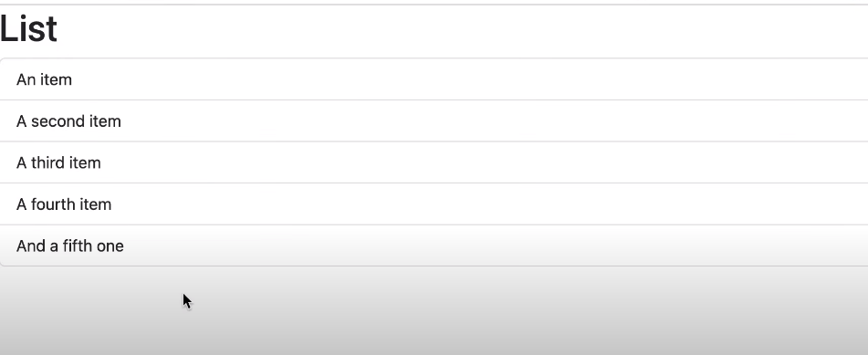

# React

<a href = "https://youtu.be/SqcY0GlETPk"> Link To Tutorial </a>

 

Date:-28/02/2024
 

Enlisted below are the things I learnt today. 👇
 

✮[1] Creating a React App
 

✮[2] Project Structure
 

✮[3] Creating a React Component
 

✮[4] How React Works
 

✮[5] React Ecosystem
 

✮[6] Building Components
 

✮[7] Creating a ListGroup Component
 

✮[8] Fragments
 

✮[9] Rendering Lists
 

✮[10] Conditional Rendering
 

✮[11] Handling Events
 

✮[12] Managing State
 

https://github.com/trieshasonarkar1224/React/assets/147965443/12007eb2-f5a8-49c0-9cc1-8a1e212ee5a2

✮[13] Passing Data Via Props
 

✮[14] Passing Functions Via Props
 

https://github.com/trieshasonarkar1224/React/assets/147965443/5f58d1ca-3ab2-47f0-b6cf-1a89141dc200

✮[15] State Vs Props
 

✮[16] Passing Children
 

✮[17] Inspecting Components with React Dev Tools 
 

✮[18] Exercise: Building a Button Component 
 

✮[19] Exercise: Showing an Alert

https://github.com/trieshasonarkar1224/React/assets/147965443/772d314c-2238-4401-a9b2-4ae442633188
